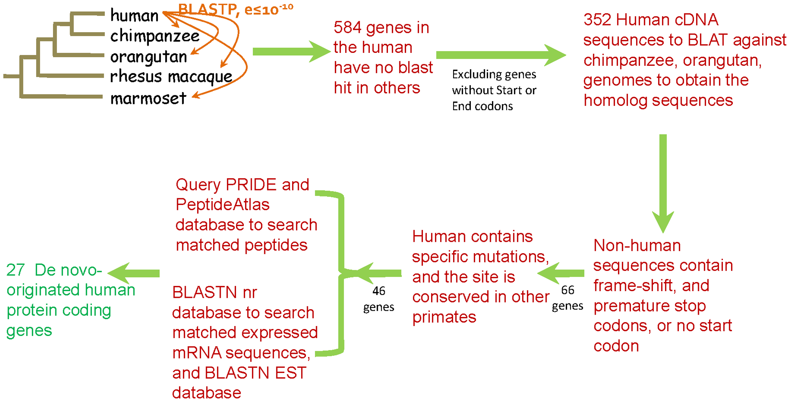
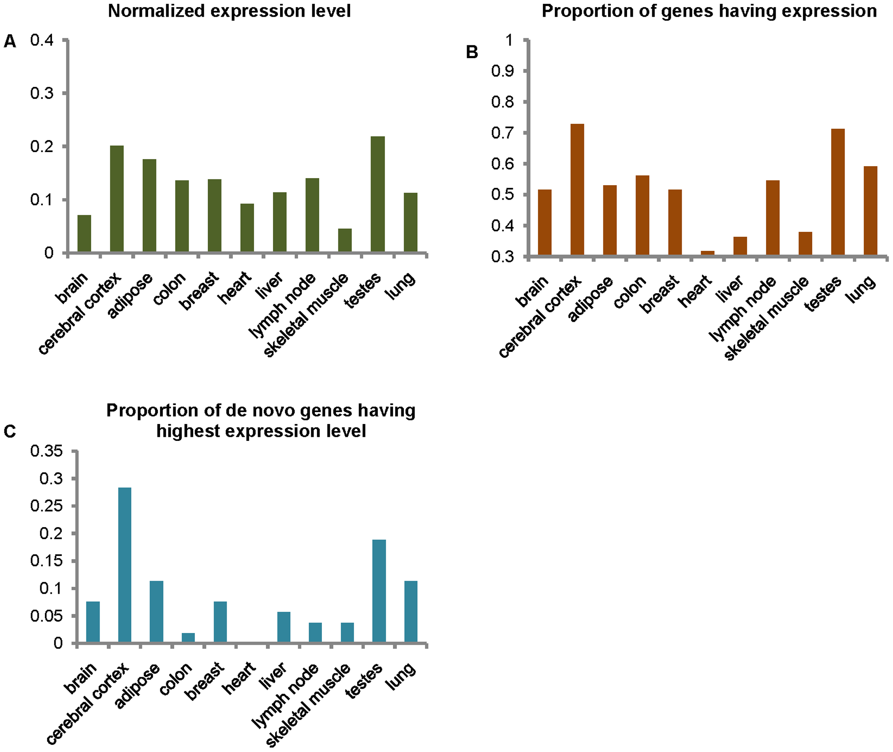
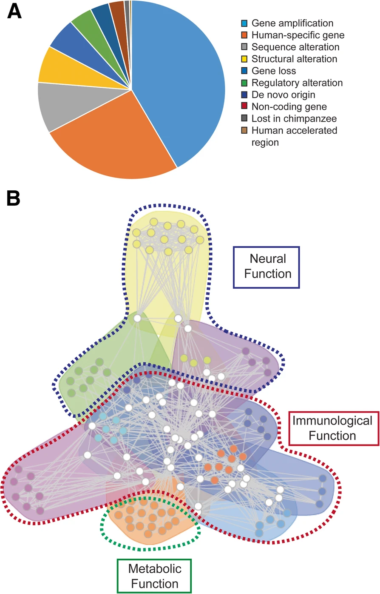
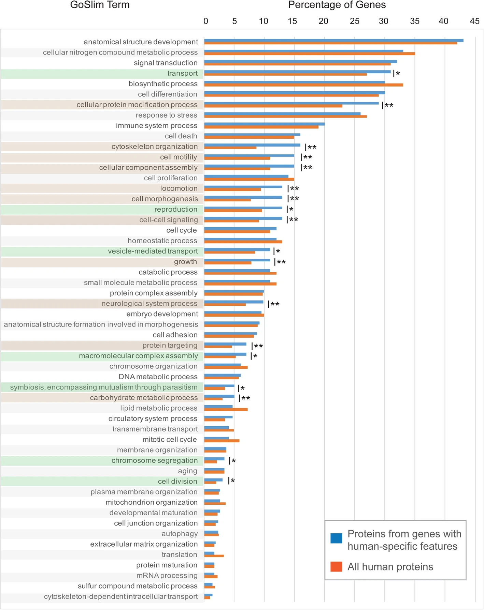
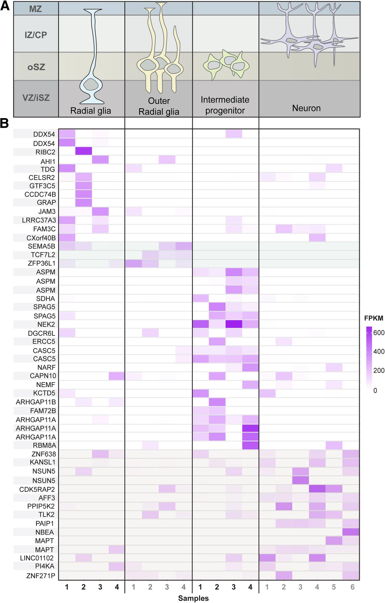

# find_human_gene.pro

`Lean Project` (`.pro`) for getting genes found in humans but not in mice (and vice versa) :baby:

### `Human Gene`

[human_gene_by_method.tsv](./output/human_gene_by_method.tsv) is a table whose rows are the genes found in humans but not in mice (`human gene`s) and columns are methods: `Ensembl`, `MGI`, `2011 paper`, and `2019 paper`.

There is not a perfect method to identify `human gene`s.
So I tried 4 approaches, hoping that the genes consistently identified by more of the methods are more confident `human genes`s.
The last column of the table is the number of times `human gene`s are identified in the methods.
The `human gene` at the top is `DNAH10OS` which has the score of 4, meaning that all 4 methods identified it as a `human gene`.

### Methods

In 2 of the methods, I get `human gene`s already identified from a paper.
The papers are: [De Novo Origin of Human Protein-Coding Genes](https://journals.plos.org/plosgenetics/article?id=10.1371/journal.pgen.1002379) (`2011 paper`) and [Genes with human-specific features are primarily involved with brain, immune and metabolic evolution](https://bmcbioinformatics.biomedcentral.com/articles/10.1186/s12859-019-2886-2) (`2019 paper`).
`2011 paper` identified ~60 _de novo_ `human gene`s.
`2019 paper` identified ~900 `human gene`s.
Then, to make the gene symbols consistent, I update their `human gene` symbols to be `HGNC`.

In the other 2 methods, I rely on homologies to identify `human gene`s.
There is not a perfect method to identify homologies.
So I rely on human-mouse homologies maintained by 2 major, ongoing bioinformatics efforts: the Mosue Genome Informatics (`MGI`) and `Ensembl`.
In each method, I use their inferred homologies to select human protein-coding genes that do not have any homology.

There are 66 `human gene`s identified by at least 3 methods and 1071 by at least 2.

### `Mouse Gene`

[mouse_gene_by_method.tsv](./output/mouse_gene_by_method.tsv) is a table whose rows are the genes found in mice but not in humans (`mice gene`s) and columns are methods: `Ensembl` and `MGI`.

I repeat the same processes described above for mice.

There are 2293 `mouse gene`s identified by both methods.

## `2011 paper` De Novo Origin of Human Protein-Coding Genes

### Identified 60 human specific protein-coding genes of de novo origin, strictly

### Lesson

- De novo genes listed in the previous versions of various databases are removed.
- De novo genes are often single copy, single exon, and small.
- Humans split from chimpanzee 6 million years ago.
- De novo gene birth rate is 10 genes per million years.
- De novo genes' expressions are low.
- De novo genes have higher substitution rate than human genome; but the corresponding chimpanzee sequences have even higher rate.
- De novo genes may be made in testes, which is more demethylated and histone modified for more expression.

## `2019 paper` Genes with human-specific features are primarily involved with brain, immune and metabolic evolution

### Lesson

- Human and chimpanzee genomes differ in 30 million substitutions, which is 1.2% of the human genome.
- The human brain size 3Xed in 2 million years.
- Subventricular zone produces neuronal cells.
- Chromosome X and 7 have more human-specific genes.
- The human specific genes influence infection, diet, and brain expansion.

### Thoughts

I wonder why there is more `mice gene`s than `human gene`s.

How many genes are there in mice anyways?

It may be nice to plot the identified genes by gene families.

---

## Howdy :wave: :cowboy_hat_face:

To report a bug, request a feature, or leave a comment, just [submit an issue](https://github.com/KwatMDPhD/find_human_gene.pro/issues/new/choose).

---

_**Lean Project** powered by https://github.com/KwatMDPhD/LeanProject.jl_
